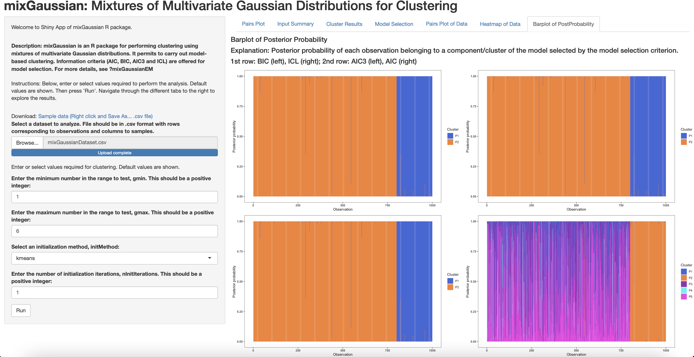

# `mixGaussian`

## Description
`mixGaussian` is a simple R package for performing clustering using mixtures of multivariate Gaussian distributions. Main function __*mixGaussianEM*__ permit to carry out model-based clustering. Information criteria (AIC, BIC, AIC3 and ICL) are offered for model selection. The shiny implementation of *mixGaussian* is available as __*runMixGaussian*__. For more information, see details below.  

## Installation

To install the latest version of the package:

``` r
require("devtools")
install_github("anjalisilva/mixGaussian", build_vignettes = TRUE)
library("mixGaussian")
```


## Overview

`mixGaussian` contains 6 functions. 

For carrying out clustering of data using mixtures of multivariate Gaussian distributions via expectation-maximization (EM): __*mixGaussianEM*__. 

Information criteria are offered for model selection: __*AICFunction*__, __*BICFunction*__, __*AIC3Function*__, __*ICLFunction*__. 

The shiny implementation of *mixGaussian*: __*runMixGaussian*__. 

To list all functions available in the package: 

``` r
ls("package:mixGaussian")
```

For tutorials, refer to the vignette:

``` r
browseVignettes("mixGaussian")
```

Alternative, the Shiny app could be run:
``` r
mixGaussian::runMixGaussian()
```

<div style="text-align:center">

<div style="text-align:center">
  
 Figure: Shiny app for mixGaussian package showing cluster results.

<div style="text-align:left">
<div style="text-align:left">


## Details

<div style="text-align:left">

<div style="text-align:left">
<div style="text-align:left">

For more details, see vignette.

## `mixGaussian` Specifics

In `mixGaussian` the parameter and group membership estimation is carried out using the EM algorithm, because the complete-data consists of the unobserved group membership labels. To check the convergence of EM algorithm, a modified version of Aitken's acceleration criterion as outlined by B¨ohning et al., 1994 is used. Model selection is performed using AIC, BIC, AIC3 and ICL. For more details, see vignette.


## Citation for Package
``` r
citation("mixGaussian")
```

## References for Package

* [Aitken, A. C. (1926). A series formula for the roots of algebraic and transcendental equations. *Proceedings of the Royal Society of Edinburgh*](https://www.cambridge.org/core/journals/proceedings-of-the-royal-society-of-edinburgh/article/iiia-series-formula-for-the-roots-of-algebraic-and-transcendental-equations/0CC96A97C8B634E2730F5208E506E6A9)

* [B¨ohning, D., E. Dietz, R. Schaub, P. Schlattmann, and B. Lindsay (1994). The distribution of the likelihood ratio for mixtures of densities from the one-parameter exponential family. *Annals of the Institute of Statistical Mathematics*](https://link.springer.com/article/10.1007/BF01720593)

* [Dempster, A. P., N. M. Laird, and D. B. Rubin (1977). Maximum likelihood from incomplete data via the EM algorithm. *Journal of the Royal Statistical Society: Series B*](https://www.ece.iastate.edu/~namrata/EE527_Spring08/Dempster77.pdf)

* For others, refer to help page of inidividual functions via `?function` or `help(function)`.


## Maintainer

* Anjali Silva (anjali.silva@uhnresearch.ca). 


## Contributions

`mixGaussian` welcomes issues, enhancement requests, and other contributions. To submit an issue, use the [GitHub issues](https://github.com/anjalisilva/mixGaussian/issues).

