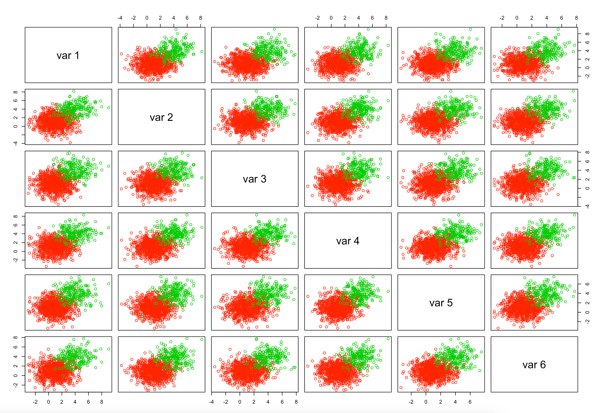

# A tour of mixGaussian
       
## Introduction


**mixGaussian** is a simple R package for performing clustering using mixtures of multivariate Gaussian distributions. Main function __*mixGaussianEM*__ permits to carry out model-based clustering with parameter estimation via expectation-maximization (EM) algorithm. Information criteria (AIC, BIC, AIC3 and ICL) are offered for model selection. Function __*mixGaussianVisualize*__ (under construction) permits to visualize clustering results. Function __*mixGaussianDataGenerator*__ (under construction) is available to generate simlulation data. The shiny implementation of *mixGaussian* is available as __*runMixGaussian*__ (under construction). For more information, see details below. **This document gives a tour of mixGaussian (version 0.1.0) functionalities**. It was written in R Markdown, using the [knitr](https://cran.r-project.org/package=knitr) package for production. 


See `help(package = "mixGaussian")` for further details and references provided by `citation("mixGaussian")`. To download **mixGaussian**, use the following commands:

``` r
require("devtools")
install_github("anjalisilva/mixGaussian", build_vignettes = TRUE)
library("mixGaussian")
```
To list all functions available in the package:
``` r
lsf.str("package:mixGaussian")
```

<br>

## Details

Finite mixture models assume that a population consists of a finite collection of subpopulations and that each subpopulation can be modeled using a statistical distribution. A Gaussian mixture model assumes a Gaussian strcture for each population. 


Given *d*-dimensional data vectors $y_1$,..,$y_n$, the model density of a Gaussian mixture is

\begin{equation*}
\begin{split}
f(\boldsymbol{y} | \boldsymbol{\vartheta}) = \sum_{g=1}^{G} \pi_g \phi(\boldsymbol{y}|\boldsymbol{\mu}_g, \boldsymbol{\Sigma}_g),
\end{split}
\end{equation*}

where $G$ is the total number of clusters, $\phi(.)$ is the probability density function of Gaussian distribution with mean $\boldsymbol{\mu}_g$ and covariance $\boldsymbol{\Sigma}_g$, and $\pi_g$ is the mixing proportion of the gth component such that $0 < \pi_g \leq 1$ and $\sum_{g=1}^G \pi_g = 1$.

In model-based clustering applications, the cluster membership of all observations is (assumed) unknown and an indicator variable $\mathbf{Z}_i$ is used, where $i = 1, \ldots, n$. The $\mathbf{Z}_i$ are assumed to be independent and identically distributed with a multinomial distribution. Here, $\mathbf{z}_i = (z_{i1}, \ldots, z_{iG})$ is a realization of $\mathbf{Z}_i$. The ${z}_{ig}$ take on a value of $1$ if the $i$th observation belongs to component $g$ and $0$ otherwise. The predicted group memberships at the maximum likelihood estimates of the model parameters are given by the maximum \textit{a posteriori} probability, $\text{MAP}(\hat{z}_{ig})$, such that $\text{MAP}(\hat{z}_{ig}) = 1$ if $\text{max}_h(\hat{z}_{ih}), h = 1, \ldots, G$, occurs at component $g$ and $\text{MAP}(\hat{z}_{ig}) = 0$ otherwise. The complete-data likelihood for model-based clustering can be written as
\begin{equation*}
\mathcal{L}(\boldsymbol{\vartheta}) = \prod_{i=1}^{n} \prod_{g=1}^{G} \big[ \pi_g f_g( \mathbf{y} | \boldsymbol{\theta}_g)\big]^{z_{ig}}.
\end{equation*}

Here, $\boldsymbol{\theta}_g = (\boldsymbol{\mu}_g, \boldsymbol{\Sigma}_g)$ and $\boldsymbol{\vartheta}$ denotes all model parameters such that $\boldsymbol{\vartheta} = (\pi_1,\ldots,\pi_G, \boldsymbol{\theta}_1,\ldots, \boldsymbol{\theta}_G)$.
 
### EM Framework for Parameter Estimation 

Maximum likelihood estimation is one of the most widely used methods of estimation and involves selecting the values of $\hat{\boldsymbol{\vartheta}}$ which maximizes $\mathcal{L}(\boldsymbol{\vartheta}| \mathbf{y})$. Finding the maximum of $\mathcal{L}(\boldsymbol{\vartheta}| \mathbf{y})$ is an optimization problem and, often, an iterative procedure is needed to solve this problem. The EM algorithm (Dempster et al., 1977) is an iterative procedure for the computation of maximum likelihood estimates and is commonly used in problems with missing or incomplete data. In the expectation (E-) step, the conditional expectation of complete-data log-likelihood given observed data $\mathbf{y}$ and current model parameters, termed $\mathcal{Q}$, is calculated. During the maximization (M-) step, $\mathcal{Q}$ is maximized with respect to the model parameters. The E- and M-steps are iterated until some convergence criterion is met. Note, EM algorithm relies heavily on the initial values (Biernacki et al., 2003).

### Convergence

There are several criteria for stopping an EM algorithm. A popular criterion is Aitken's acceleration (Aitken, 1926). At iteration *j*, Aitken's acceleration criterion is 

\begin{equation*}
\begin{split}
a^{(j)} & = \frac{l^{(j+1)} - l^{(j)}}{l^{(j)} - l^{(j-1)}}, 
\end{split}
\end{equation*}

where $l$ represents the posterior log-likelihoods. Convergence is achieved when 
$$|l_{\infty}^{(j+1)} - l_{\infty}^{(j)}| < \epsilon.$$ Here, $l_{\infty}^{(j+1)}$ is an asymptotic estimate of the log-likelihood (B¨ohning et al., 1994) given by
$$l_{\infty}^{(j+1)} = l^{(j)} + \frac{l^{(j+1)} - l^{(j-1)}}{1 - a^{(j)}}.$$

### Model Selection 

Model selection criteria penalizes the log-likelihood for model complexity, as the log-likelihood value favours the model with more parameters. Among the different criteria available, one is Bayesian information criterion (BIC; Schwarz, 1978). The BIC is defined as $$\text{BIC} = -2 \log \mathcal{L} (\hat{\boldsymbol{\vartheta}} |\boldsymbol{y}) + K \log n.$$ The $\mathcal{L} (\hat{\boldsymbol{\vartheta}} |\mathbf{y})$ represents maximized log-likelihood, $\hat{\boldsymbol{\vartheta}}$ is the maximum likelihood estimate of the model parameters $\boldsymbol{\vartheta}$, $n$ is the number of observations, and $K$ represents the number of free parameters in the model. There is support for the use of BIC in mixture model selection (Campbell et al., 1997). Other criteria include the Akaike information criterion (AIC; Akaike, 1973), $$\text{AIC} = -2 \log \mathcal{L} (\hat{\boldsymbol{\vartheta}} |\boldsymbol{y}) + 2K;$$ a variation on the AIC used by Bozdogan (1994), $$\text{AIC3} =  -2 \log \mathcal{L} (\hat{\boldsymbol{\vartheta}}|\boldsymbol{y}) + 3K;$$ and the integrated completed likelihood (ICL; Biernacki et al., 2000), $$\text{ICL} \approx \text{BIC} - 2 \sum_{i=1}^n \sum_{g=1}^G \text{MAP}(\hat{z}_{ig}) \log \hat{z}_{ig}.$$ Here, $\text{MAP}(\hat{z}_{ig})$ is the maximum $\textit{a posteriori}$ classification given $\hat{z}_{ig}$.

As the number of clusters in the finite mixture model is almost always unknown, the parameter estimation methods are fitted for a range of possible number of components and the optimal number is selected using a model selection criterion. Varying model selection criteria differ in terms of the log-likelihood is penalized. The AIC and AIC3 penalize log-likelihood only for the number of free parameters in the model and are constant with respect to the sample size. When the number of observations is large, the AIC tends to favor more complex models (Shibata, 1976; Katz, 1981) and it overestimates number of components in the model.  BIC penalizes the log-likelihood based on both the number of  free parameters in the model and the number of observations. The BIC selects the number of mixture components needed to provide a good approximation to the density, rather than the number of clusters. As a result, BIC can assign multiple mixture components to a single cluster. The ICL penalizes BIC for the estimated mean entropy based on the spread of the mixture components. The ICL favors well separated clusters compared to BIC (Biernacki et al., 2000).


## `mixGaussian` Algorithm

In `mixGaussian` the parameter and group membership estimation is carried out using the EM algorithm, because the complete-data consists of the unobserved group membership labels. To check the convergence of EM algorithm, a modified version of Aitken's acceleration criterion as outlined by B¨ohning et al., 1994 is used with $\epsilon = 0.001$. Model selection is performed using AIC, BIC, AIC3 and ICL.


## Clustering Data

Here, an example dataset is created with two components, with a mixing proportion of 0.8 and 0.2. There are 100 observations in the dataset and the dimensionality is 6. 
``` r
 G <- 2 # number of true clusters/components
 dimension <- 6
 nObservations <- 1000
 piGTrue <- c(0.8, 0.2)

 set.seed(1234)
 mean1 <- rep(1, dimension)
 mean2 <- rep(4, dimension)
 sigma1 <- diag(dimension) * 2
 sigma2 <- diag(dimension) * 2

 # library(mvtnorm)
 component1 <- mvtnorm::rmvnorm(nObservations * piGTrue[1], mean = mean1, sigma = sigma1)
 dim(component1)
 component2 <- mvtnorm::rmvnorm(nObservations * piGTrue[2], mean = mean2, sigma = sigma2)
 dim(component2)
 dataset <- rbind(component1, component2)
 dim(dataset) # 100   6

 # Visualize data
 pairs(dataset, col = c(rep(2, nObservations * piGTrue[1]), rep(3, nObservations * piGTrue[2])))
```

<div style="text-align:center">
<div style="text-align:left">
<br>
<div style="text-align:left">


``` r
 # Cluster data
 clustOutput <- mixGaussian::mixGaussianEM(dataset = dataset,
                                           membership = c(rep(1, nObservations * piGTrue[1]),
                                                          rep(2, nObservations * piGTrue[2])),
                                           gmin = 1,
                                           gmax = 5,
                                           initMethod = "kmeans",
                                           nInitIterations = 1)

```

The model selected by BIC for this dataset can be viewed as follows.

``` r
clustOutput$BICresults$BICmodelselected
```


## References

* [Aitchison, J. and C. H. Ho (1989). The multivariate Poisson-log normal distribution. Biometrika 76.](https://www.jstor.org/stable/2336624?seq=1)

*  [Aitken, A. C. (1926). A series formula for the roots of algebraic and transcendental equations. *Proceedings of the Royal Society of Edinburgh*](https://www.cambridge.org/core/journals/proceedings-of-the-royal-society-of-edinburgh/article/iiia-series-formula-for-the-roots-of-algebraic-and-transcendental-equations/0CC96A97C8B634E2730F5208E506E6A9)

* [Akaike, H. (1973). Information theory and an extension of the maximum likelihood principle. In *Second International Symposium on Information Theory*, New York, NY, USA, pp. 267–281. Springer Verlag.](https://link.springer.com/chapter/10.1007/978-1-4612-1694-0_15)

* [Biernacki, C., G. Celeux, and G. Govaert (2000). Assessing a mixture model for clustering with the integrated classification likelihood. *IEEE Transactions on Pattern Analysis and Machine Intelligence*.](https://hal.inria.fr/inria-00073163/document)

* [B¨ohning, D., E. Dietz, R. Schaub, P. Schlattmann, and B. Lindsay (1994). The distribution of the likelihood ratio for mixtures of densities from the one-parameter exponential family. *Annals of the Institute of Statistical Mathematics*](https://link.springer.com/article/10.1007/BF01720593)

* [Bozdogan, H. (1994). Mixture-model cluster analysis using model selection criteria and a new informational measure of complexity. In *Proceedings of the First US/Japan Conference on the Frontiers of Statistical Modeling: An Informational Approach: Volume 2 Multivariate Statistical Modeling*, pp. 69–113. Dordrecht: Springer Netherlands.](https://link.springer.com/chapter/10.1007/978-94-011-0800-3_3)

* Campbell, J., C. Fraley, F. Murtagh, and A. Raftery (1997). Linear flaw detection in woven textiles using model-based clustering. *Pattern Recognition Letters*.

* [Dempster, A. P., N. M. Laird, and D. B. Rubin (1977). Maximum likelihood from incomplete data via the EM algorithm. *Journal of the Royal Statistical Society: Series B*](https://www.ece.iastate.edu/~namrata/EE527_Spring08/Dempster77.pdf)

* Katz, R. W. (1981). On some criteria for estimating the order of a Markov chain. *Technometrics*.

* [Schwarz, G. (1978). Estimating the dimension of a model. *The Annals of Statistics* 6.](https://www.jstor.org/stable/2958889?seq=1)

* Shibata, R. (1976). Selection of the order of an autoregressive model by Akaike’s information criterion. *Biometrika*. 


